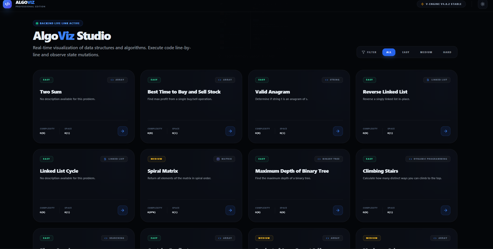
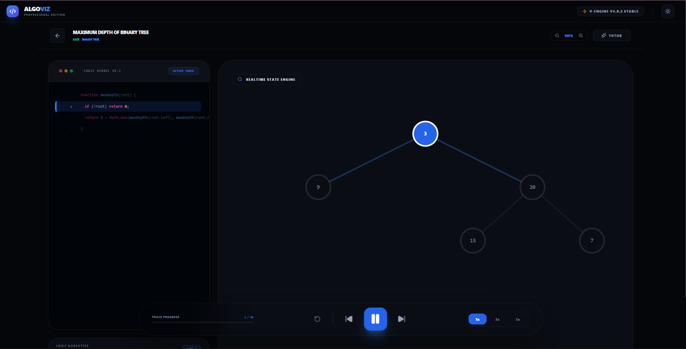
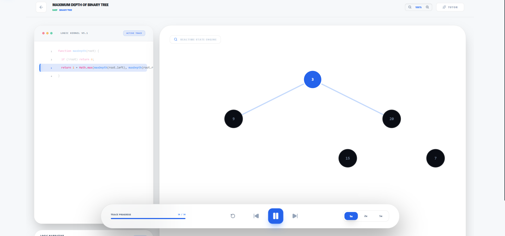
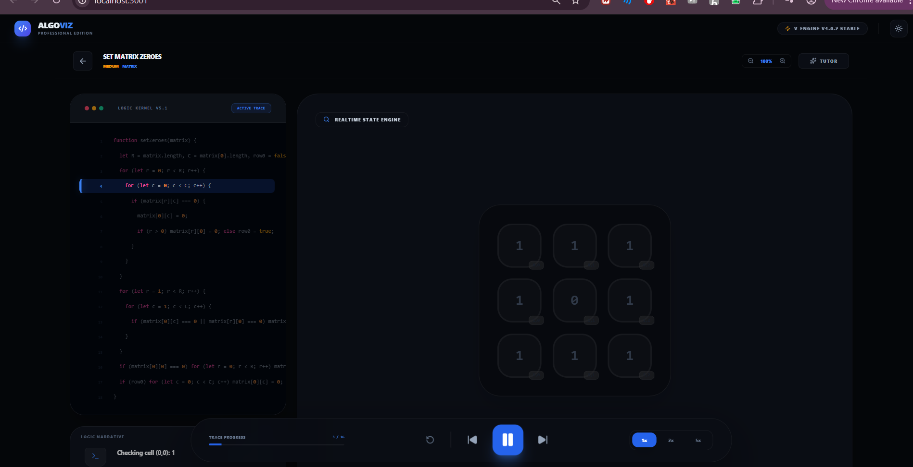
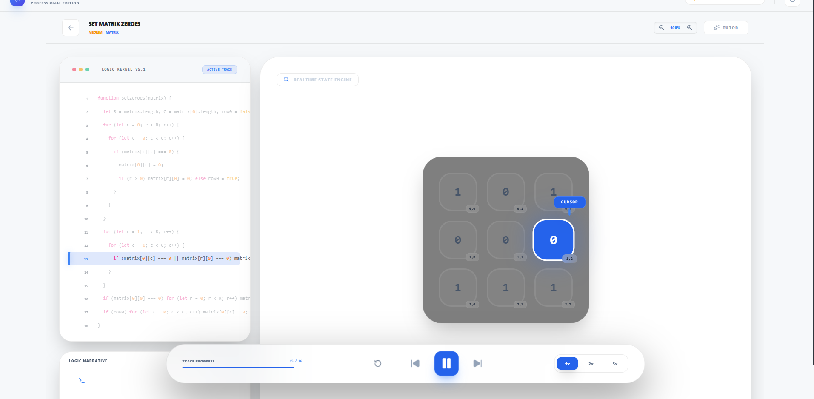

# 🧠 AlgoViz Pro: High-Fidelity Algorithm Execution Engine

AlgoViz Pro is a learning platform that helps students understand DSA (Data Structures and Algorithms) with visualization.

It shows the logic of DSA step-by-step and visually explains how the code works during execution.

---
## Home Screen


## Visualization Screen



## Question Example 1



## Question Example 2



## Question Example 3



## Question Example 4



## 🏗️ System Architecture

The platform is built on a **Snapshot-Based State Machine**. Instead of animating transitions loosely, the system generates a discrete timeline of state snapshots.

1.  **Logic Mirroring (Tracer)**: The `stepGenerator.ts` mirrors the algorithm logic. For every line of code executed, it captures a snapshot containing current variables, pointer positions, and data structure state.
2.  **Polymorphic Rendering**: The UI observes the `visualType` of a problem (ARRAY, TREE, MATRIX, etc.) and dynamically mounts the corresponding high-fidelity visualizer.
3.  **AI Reasoning Kernel**: Powered by **Google Gemini**, the system provides real-time algorithm tutoring and complexity analysis, grounding its responses in the actual code being visualized.

---

## 📁 File Explanations

### Core Logic
*   **`index.tsx`**: Entry point for the React application. Handles the mounting of the virtual DOM.
*   **`App.tsx`**: The main orchestrator. Manages global state, theme switching, problem filtering, and the transition between the Dashboard and the Studio view.
*   **`types.ts`**: The "Source of Truth" for the engine. Defines the `AlgorithmStep` interface which acts as the data packet for every execution cycle.
*   **`constants.ts`**: A curated registry of the **Blind 75** problems, including initial data, metadata, and optimized code snippets in multiple languages.

### Visual Components (`/components`)
*   **`Visualizer.tsx`**: The main canvas component. Manages the playback timer and passes the "Current Step" to sub-visualizers.
*   **`VisualizationPanel.tsx`**: A polymorphic dispatcher that decides whether to render a Grid, Tree, or List based on the problem metadata.
*   **`CodePanel.tsx`**: An IDE-grade code viewer that supports syntax highlighting and synchronous line-scrolling linked to the visualization timeline.
*   **`MemoryInspector.tsx`**: A specialized view into the **Stack** and **Heap**, showing object allocations and pointer references.
*   **`AITutor.tsx`**: An integrated chat interface that connects to `gemini-3-flash-preview` for real-time logic assistance.

### Services (`/services`)
*   **`stepGenerator.ts`**: The engine's "Brain". It contains the manual trace logic for all algorithms to ensure the visualization is 100% accurate to the code.
*   **`gemini.ts`**: Wrapper for the `@google/genai` SDK. Configures system instructions and handling for the AI reasoning kernel.
*   **`api.ts`**: Abstracts data fetching. It checks for a local FastAPI backend but falls back to the internal `INITIAL_PROBLEMS` for offline capability.

---

## 💻 Local Development

Follow these steps to get the AlgoViz Pro environment running on your machine.

### Prerequisites
- **Node.js** (v18 or higher)
- **Python** (v3.10 or higher)
- **MongoDB** (Optional, for full persistence support)

---

### 🎨 Frontend Setup (React + Vite)
The core simulation engine and UI live here.

1.  **Install Dependencies**:
    ```bash
    npm install
    ```
2.  **Environment Configuration**:
    Create a `.env.local` file in the root directory:
    ```env

3.  **Run Development Server**:
    ```bash
    npm run dev
    ```
    The frontend will be accessible at `http://localhost:5173`.

---

### ⚙️ Backend Setup (FastAPI Asset Server)
Provides problem definitions and algorithmic metadata.

1.  **Navigate to Backend**:
    ```bash
    cd backend
    ```
2.  **Setup Virtual Environment** (Recommended):
    ```bash
    python -m venv venv
    # Windows:
    .\venv\Scripts\activate
    # macOS/Linux:
    source venv/bin/activate
    ```
3.  **Install Dependencies**:
    ```bash
    pip install fastapi uvicorn motor
    ```
4.  **Populate Database** (Optional):
    If you want to refresh the local problem set:
    ```bash
    cd ..
    node populate_db.cjs
    cd backend
    ```
5.  **Run Backend Server**:
    ```bash
    python -m uvicorn app.main:app --host 0.0.0.0 --port 8000 --reload
    ```

---

## 🚀 Deployment

AlgoViz Pro is designed for zero-config deployment on free tiers.

### 1. Vercel (Frontend)
The React/Vite UI works perfectly on Vercel.
- **Root Directory**: `.`
- **Build Command**: `npm run build`
- **Output Directory**: `dist`
- **Environment Variables**: 
  - `VITE_GEMINI_API_KEY`: Your Google Gemini API Key.
  - `VITE_API_BASE_URL`: The URL of your Render backend (once deployed).

### 2. Render (Backend)
FastAPI and the static assets can be hosted for free on Render.
- **Service Type**: Web Service
- **Environment**: Python 3
- **Root Directory**: `backend`
- **Build Command**: `pip install -r requirements.txt`
- **Start Command**: `uvicorn app.main:app --host 0.0.0.0 --port $PORT`

### 3. Database (Optional)
For full persistence, use a free **MongoDB Atlas** M0 cluster.
- Add `MONGODB_URL` to your Render environment variables.
- The system will automatically detect the database and use it.

---

## 🔍 Verification Checklist
After deployment, verify the following:
1. **Health Check**: Visit `YOUR_BACKEND_URL/health` to ensure the asset server is live.
2. **CORS**: Ensure your Vercel URL is allowed in the backend settings.
3. **AI Logic**: Chat with the AI Tutor to verify the Gemini integration.
l `gemini-3-pro-preview`**: Used for initial algorithm explanation (high reasoning capability).
*   **Model `gemini-3-flash-preview`**: Used for the interactive chat tutor (low latency for real-time questions).

The system instruction ensures the AI behaves as a "Senior Technical Interviewer" who guides students toward the answer using Socratic questioning rather than just providing the solution.